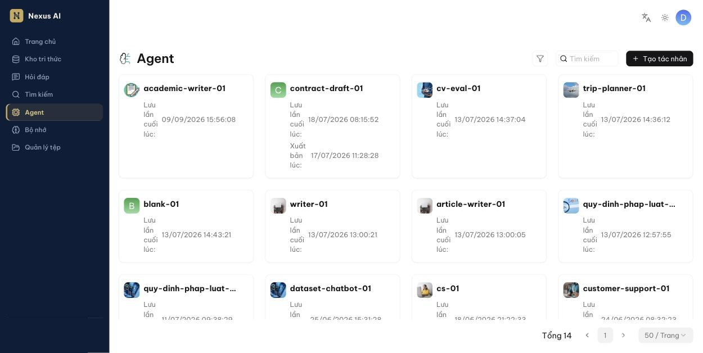
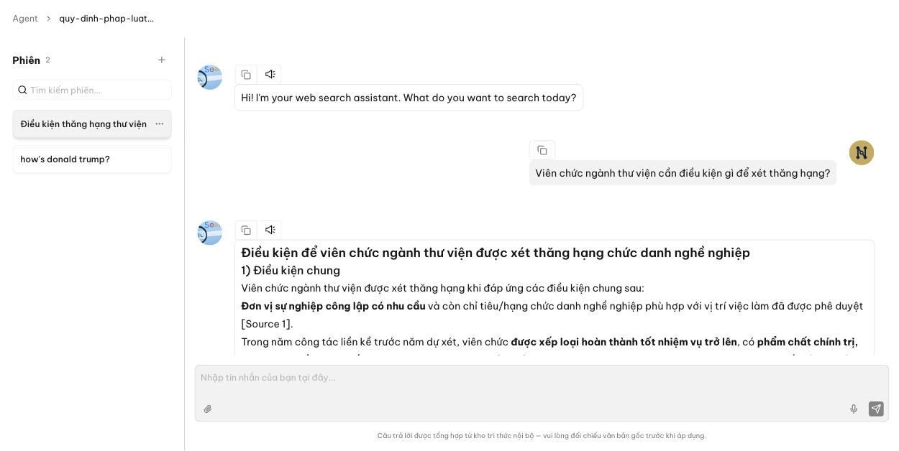
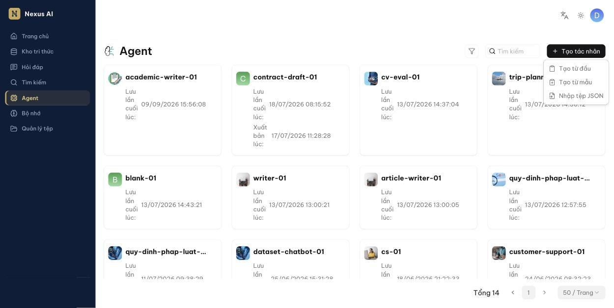
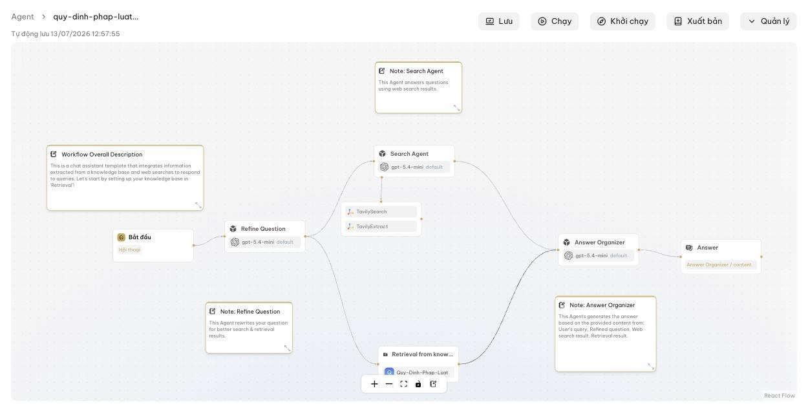

<!-- upstream: docs/guides/agent/agent_introduction.md @ 91f7edf -->

# Giới thiệu Agent

Khái niệm chính, cách trò chuyện với Agent và cách tạo Agent từ mẫu.

---

## Khái niệm

Agent là một *luồng xử lý* (workflow) gồm nhiều bước nối với nhau: nhận câu hỏi, phân loại ý định, truy hồi từ kho tri thức, gọi mô hình ngôn ngữ, gọi công cụ bên ngoài (tìm kiếm web, gọi API, …). Agent bổ sung cho hỏi đáp thông thường khi bạn cần:

- Kết quả truy hồi chính xác hơn nhờ các bước viết lại câu hỏi, phân loại, dẫn dắt hội thoại.
- Các kịch bản phức tạp: hỏi đáp có điều kiện, tra cứu nhiều nguồn, tạo báo cáo, tự động hóa quy trình.

Nexus AI cung cấp trình soạn thảo kéo-thả không cần lập trình và bộ mẫu Agent cho các tình huống thường gặp. Với hầu hết người dùng, **dùng Agent do đồng nghiệp hoặc quản trị viên đã tạo và chia sẻ** là đủ; phần tạo Agent dành cho người cần tùy biến.

## Trò chuyện với Agent

1. Nhấn **Agent** ở thanh điều hướng bên trái. Mỗi thẻ là một Agent bạn sở hữu hoặc được chia sẻ.

    

2. Nhấn vào Agent để mở trình soạn thảo, rồi nhấn **Khởi chạy** ở góc trên bên phải.
3. Trong cột **Phiên** bên trái, nhấn **+** để tạo phiên mới, nhập câu hỏi và gửi.

    

Mỗi cuộc trò chuyện được lưu thành một *phiên*:

- Phiên mới hiển thị là **Chưa đặt tên**; sau lượt trả lời đầu tiên, hệ thống tự đặt tên theo nội dung câu hỏi (tên mới xuất hiện khi bạn chọn lại phiên hoặc tải lại trang).
- Nhấn biểu tượng ba chấm bên cạnh phiên để **Đổi tên** hoặc **Xóa phiên**. Tên bạn tự đặt sẽ không bị hệ thống ghi đè.
- Ô **Tìm kiếm phiên…** giúp lọc nhanh khi có nhiều phiên.

!!! note
    Phiên chỉ hiển thị cho chính người tạo. Đồng nghiệp dùng chung một Agent sẽ thấy danh sách phiên riêng của họ.

## Tạo Agent

!!! tip "Trước khi bắt đầu"
    Đảm bảo bạn đã có kho tri thức với tài liệu phân tích xong (xem [Cấu hình kho tri thức](../kho-tri-thuc/cau-hinh.md)) nếu Agent cần tra cứu tài liệu.

1. Trên trang **Agent**, nhấn **Tạo tác nhân** và chọn cách tạo:

    

    - **Tạo từ mẫu**: chọn một mẫu phù hợp (trợ lý hỏi đáp, hỗ trợ khách hàng, nghiên cứu sâu, …), đặt tên rồi xác nhận. Đây là cách nhanh nhất.
    - **Tạo từ đầu**: bắt đầu với canvas trống chỉ có thành phần **Bắt đầu**.
    - **Nhập tệp JSON**: khôi phục Agent từ tệp đã **Xuất** trước đó.

    *Bạn được đưa vào trình soạn thảo luồng.*

    

2. Nhấn nút **+** trên một thành phần để thêm thành phần tiếp theo; nhấn vào thành phần để chỉnh cấu hình ở bảng bên phải.
3. Nhấn **Chạy** để thử Agent ngay trong trình soạn thảo, và **Lưu** để áp dụng thay đổi.

Các nút ở góc trên bên phải trình soạn thảo:

- **Lưu**, **Chạy**, **Khởi chạy** (mở màn hình trò chuyện với phiên), **Xuất bản** (phát hành phiên bản hiện tại).
- **Quản lý**: **Biến hội thoại**, **Lịch sử phiên bản**, **Nhật ký**, **Xuất** (tải tệp JSON), **Cài đặt** (tiêu đề, ảnh, mô tả, **Quyền** chia sẻ) và **Nhúng vào trang web**.

!!! warning "Lưu ý"
    Trình soạn thảo có **Tự động lưu**, nhưng hãy nhấn **Lưu** trước khi rời trang để chắc chắn phiên bản mới nhất được áp dụng cho người dùng khác.
