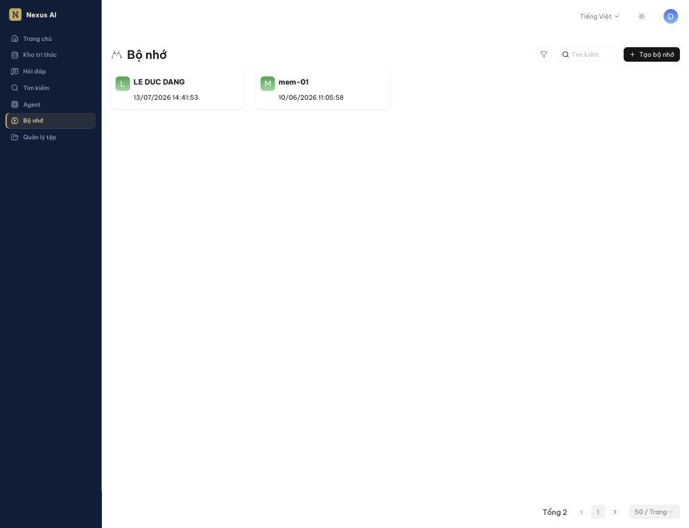
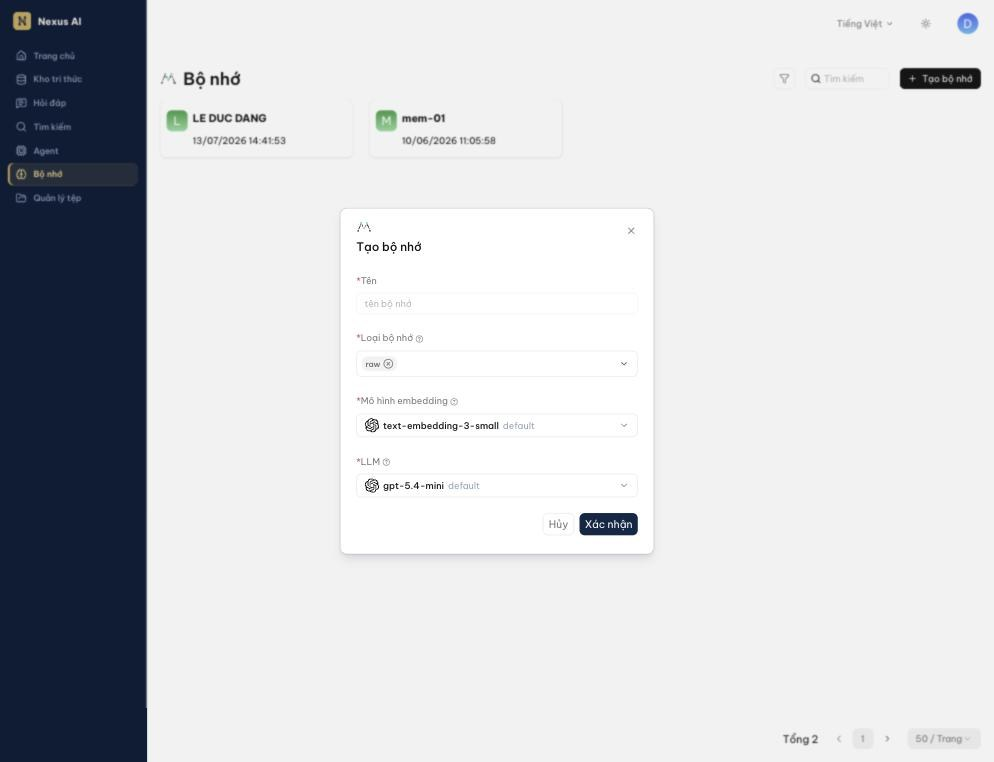
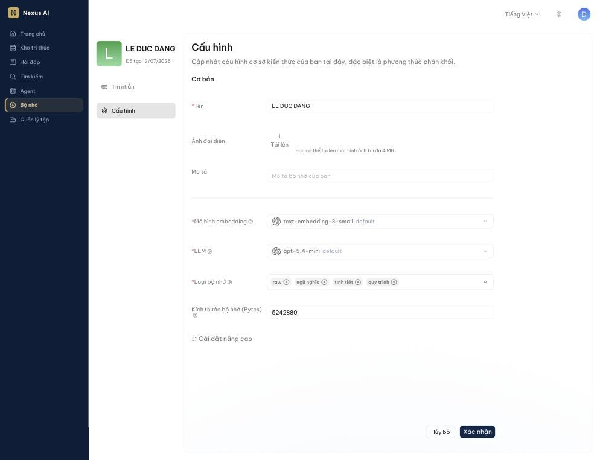
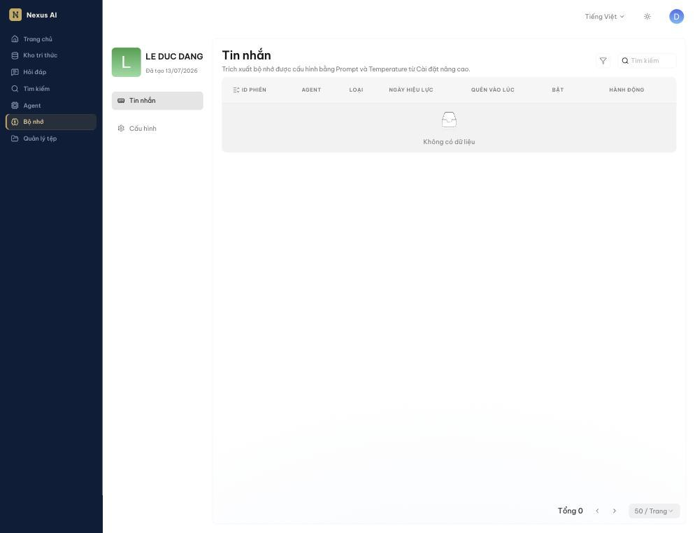
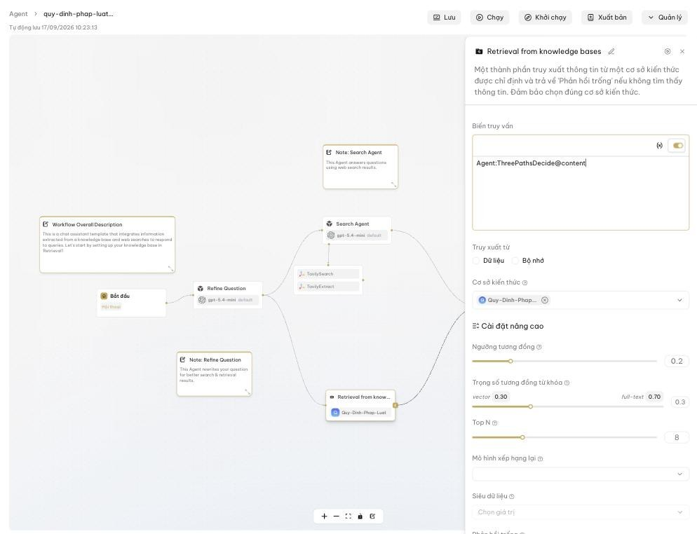
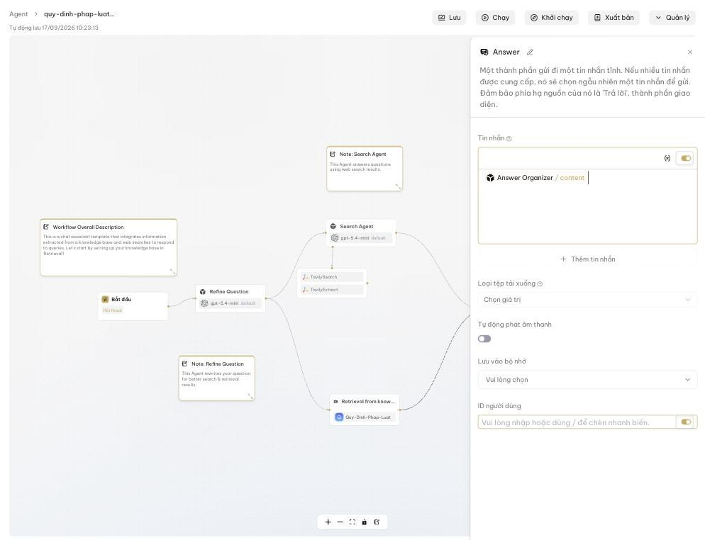

<!-- upstream: docs/guides/memory/use_memory.md, docs/guides/team/share_memory.md @ 91f7edf -->

# Bộ nhớ

Cho Agent "nhớ" các cuộc trò chuyện trước để trả lời liền mạch và cá nhân hóa hơn.

---

## Bộ nhớ là gì

Mặc định, mỗi phiên trò chuyện với Agent bắt đầu từ con số không: Agent không biết bạn đã hỏi gì ở phiên trước, không nhớ bạn là ai hay đã thống nhất điều gì. **Bộ nhớ** giải quyết việc đó. Nó lưu lại nội dung các cuộc trò chuyện mà Agent tham gia, rồi dùng mô hình ngôn ngữ để rút ra thông tin có ích, sắp xếp thành các loại và đưa trở lại vào những cuộc trò chuyện sau.

Nhờ vậy, Agent có thể:

- Tiếp nối mạch câu chuyện từ phiên trước, không hỏi lại điều đã biết.
- Nhớ các chi tiết về người dùng (vai trò, phòng ban, sở thích, việc đang làm).
- Học từ những lần trao đổi cũ để trả lời chính xác hơn.

Bộ nhớ khác kho tri thức: kho tri thức chứa *tài liệu* bạn tải lên; bộ nhớ chứa *những gì đã diễn ra trong trò chuyện*.

## Cách hoạt động

```
Người dùng ⇄ Agent
                │  Tin nhắn (Lưu vào bộ nhớ)
                ▼
            Bộ nhớ ──▶ LLM trích xuất ──▶ raw · ngữ nghĩa · tình tiết · quy trình
                ▲                                   │
                │  Truy xuất (Truy xuất từ: Bộ nhớ)  │
                └───────────────────────────────────┘
```

1. **Ghi**: khi Agent trả lời, thành phần **Tin nhắn** ghi lượt hội thoại vào bộ nhớ được chỉ định, gắn với **ID người dùng** đang trò chuyện.
2. **Trích xuất**: mô hình ngôn ngữ (**LLM**) của bộ nhớ đọc nội dung vừa ghi, rút ra thông tin và phân loại:

    | Loại bộ nhớ | Lưu gì | Ví dụ |
    |-------------|--------|-------|
    | **raw** (bắt buộc) | Nguyên văn hội thoại giữa người dùng và Agent | "Người dùng: … / Agent: …" |
    | **ngữ nghĩa** | Kiến thức, sự kiện chung về người dùng và thế giới | "Người dùng làm ở phòng Kế toán" |
    | **tình tiết** | Sự kiện cụ thể có gắn thời gian | "Ngày 12/9 người dùng hỏi về quy trình hoàn ứng" |
    | **quy trình** | Kỹ năng, thói quen, cách làm đã học | "Người dùng muốn câu trả lời dạng gạch đầu dòng" |

3. **Nhúng**: mỗi mục được chuyển thành vector bằng **Mô hình embedding** để tìm theo ngữ nghĩa.
4. **Đọc**: ở cuộc trò chuyện sau, thành phần **Truy xuất** với **Truy xuất từ: Bộ nhớ** tìm các mục liên quan đến câu hỏi và đưa vào ngữ cảnh cho Agent.
5. **Quên**: bạn có thể tắt hoặc quên từng mục; khi đầy dung lượng, hệ thống tự quên theo **Chính sách quên** (mặc định FIFO — cũ nhất bị bỏ trước), ưu tiên bỏ các mục bạn đã quên thủ công.

## Tạo bộ nhớ

1. Nhấn **Bộ nhớ** ở thanh điều hướng bên trái, rồi nhấn **Tạo bộ nhớ**.

    

2. Điền:

    

    - **Tên**: tên bộ nhớ, ví dụ *Trợ lý nhân sự – bộ nhớ khách hàng*.
    - **Loại bộ nhớ**: chọn các loại muốn lưu. **raw** luôn được chọn; thêm **ngữ nghĩa**, **tình tiết**, **quy trình** tùy nhu cầu. Chọn ít loại hơn thì trích xuất nhanh và tốn ít token hơn.
    - **Mô hình embedding**: giữ mặc định. Không đổi được sau khi bộ nhớ đã có dữ liệu.
    - **LLM**: mô hình dùng để trích xuất thông tin từ hội thoại.

3. Nhấn **Xác nhận**.

## Cấu hình bộ nhớ

Mở bộ nhớ và chọn **Cấu hình** ở cột bên trái:



- **Cơ bản**: **Tên**, **Ảnh đại diện**, **Mô tả**.
- **Mô hình embedding**, **LLM**, **Loại bộ nhớ**: như khi tạo.
- **Kích thước bộ nhớ (Bytes)**: dung lượng tối đa, mặc định 5242880 (5 MB). Mỗi tin nhắn chiếm ≈ nội dung + số chiều embedding × 8 byte; ví dụ tin nhắn 1 KB với embedding 1024 chiều tốn khoảng 9 KB, nên 5 MB chứa được khoảng 500 tin nhắn.
- **Cài đặt nâng cao** (mở rộng để xem):
    - **Quyền**: **Chỉ mình tôi** hoặc **Nhóm** (xem [Chia sẻ bộ nhớ với nhóm](#chia-se-bo-nho-voi-nhom)).
    - **Loại lưu trữ** và **Chính sách quên** khi đầy.
    - **Temperature**, **System prompt**, **User prompt** dùng cho bước trích xuất. Chỉ chỉnh khi bạn hiểu rõ prompt trích xuất; mặc định đã dùng tốt cho hầu hết trường hợp.

Nhấn **Xác nhận** sau khi thay đổi.

## Quản lý các mục đã nhớ

Chọn **Tin nhắn** ở cột bên trái của bộ nhớ để xem bảng các mục đã lưu:



Mỗi dòng gồm **ID phiên** và **Agent** đã tạo ra mục đó, **Loại** bộ nhớ, **Ngày hiệu lực**, **Quên vào lúc**, công tắc **Bật** và cột **Hành động**. Nhấn vào một dòng để xem **Nội dung** đầy đủ.

- Công tắc **Bật**: tạm tắt một mục để Agent không dùng nữa mà không xóa.
- **Quên**: loại bỏ hẳn mục đó khỏi kết quả truy xuất. Xác nhận trước khi quên; mục đã quên hiển thị thời điểm **Quên vào lúc**.

!!! tip "Mẹo"
    Định kỳ xem lại các mục đã nhớ và quên những gì không còn đúng (ví dụ người dùng đã chuyển phòng ban). Bộ nhớ sạch giúp Agent trả lời đúng hơn và tiết kiệm dung lượng.

## Gắn bộ nhớ vào Agent

Bộ nhớ chỉ có tác dụng khi Agent được cấu hình *ghi vào* và *đọc từ* nó. Cần hai thành phần trong trình soạn thảo Agent:

### Đọc từ bộ nhớ — thành phần Truy xuất

1. Thêm (hoặc chọn) thành phần **Truy xuất** (*Retrieval*) trong luồng.
2. Ở **Truy xuất từ**, chọn **Bộ nhớ** thay vì **Dữ liệu** (kho tri thức), rồi chọn bộ nhớ trong danh sách.
3. **Biến truy vấn**: thường là câu hỏi của người dùng (`sys.query`) hoặc câu hỏi đã được viết lại ở bước trước.

    

Kết quả truy xuất được đưa vào ngữ cảnh của các thành phần phía sau (ví dụ thành phần **Agent** sinh câu trả lời).

### Ghi vào bộ nhớ — thành phần Tin nhắn

1. Mở thành phần **Tin nhắn** (*Message*) ở cuối luồng, nơi Agent trả lời người dùng.
2. Ở **Lưu vào bộ nhớ**, chọn cùng bộ nhớ đã dùng ở bước Truy xuất.
3. **ID người dùng**: định danh người đang trò chuyện để bộ nhớ tách riêng thông tin của từng người. Có thể để trống (dùng tài khoản đăng nhập) hoặc chèn biến bằng `/`.
4. Nhấn **Lưu** trên trình soạn thảo.

    

Từ đó, mỗi lượt trả lời sẽ được ghi vào bộ nhớ và mô hình sẽ trích xuất thông tin theo các loại đã chọn.

!!! note
    Một bộ nhớ có thể dùng chung cho nhiều Agent: Agent A ghi, Agent B đọc. Đây là cách để các trợ lý nghiệp vụ khác nhau chia sẻ hiểu biết về cùng một người dùng.

## Chia sẻ bộ nhớ với nhóm

Bộ nhớ không tự chia sẻ. Để thành viên nhóm dùng được:

1. Mở bộ nhớ, chọn **Cấu hình** và mở rộng **Cài đặt nâng cao**.
2. Đổi **Quyền** từ **Chỉ mình tôi** sang **Nhóm**.
3. Nhấn **Xác nhận**.

## Câu hỏi thường gặp

### Bộ nhớ có tự bật cho Hỏi đáp không?

Không. Bộ nhớ dành cho **Agent**. Trợ lý **Hỏi đáp** vẫn có ngữ cảnh trong *cùng một* cuộc trò chuyện (**Tối ưu hóa đa lượt**), nhưng không nhớ sang cuộc trò chuyện khác.

### Xóa bộ nhớ thì sao?

Toàn bộ tin nhắn trong bộ nhớ bị xóa và Agent không truy xuất được nữa. Các Agent đang gắn bộ nhớ đó cần được cấu hình lại.

### Bộ nhớ có tốn token không?

Có. Mỗi lượt ghi kích hoạt một lần gọi LLM để trích xuất, và mỗi lượt đọc thêm một lần nhúng câu hỏi. Chọn ít **Loại bộ nhớ** hơn nếu cần tiết kiệm.
