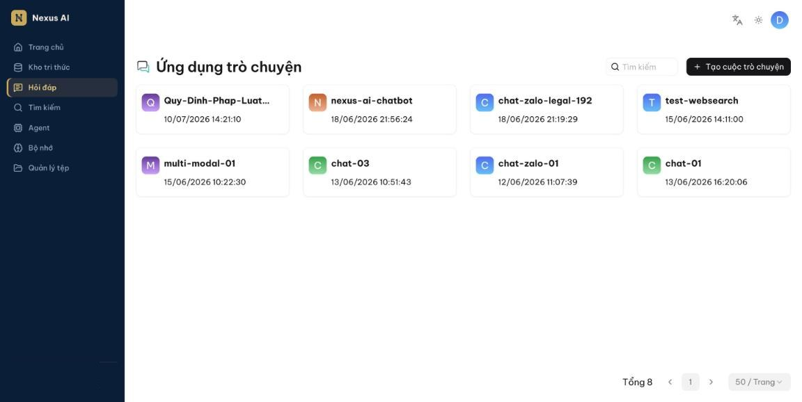
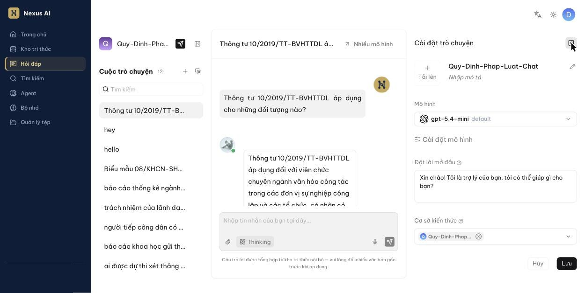
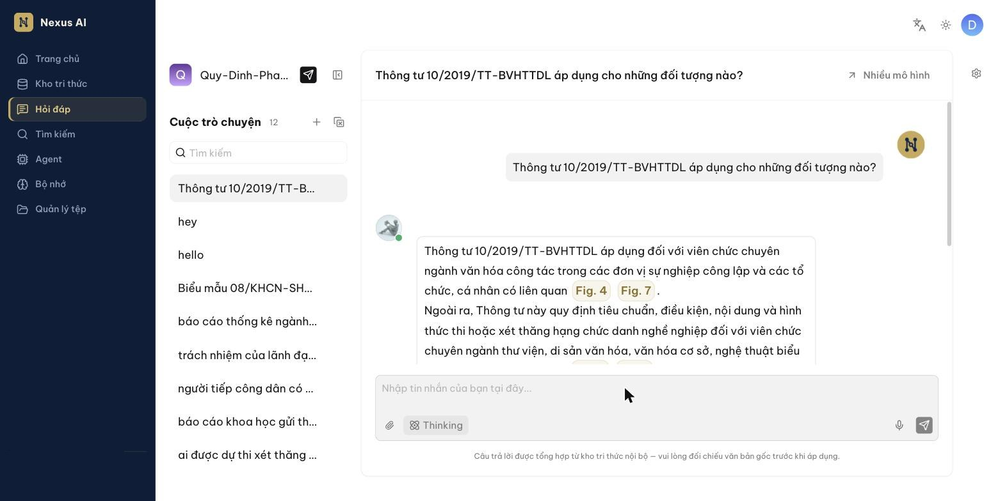
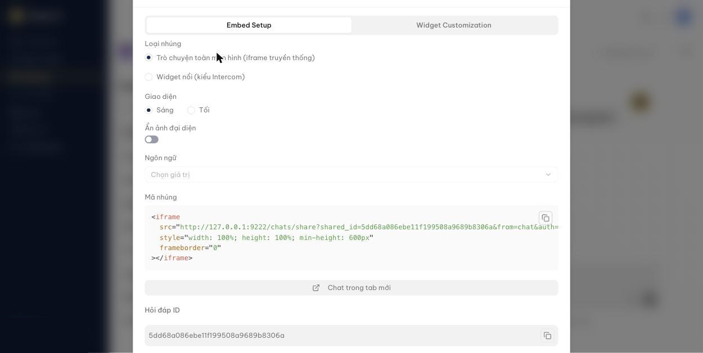

<!-- upstream: docs/guides/chat/start_chat.md @ 91f7edf -->

# Bắt đầu hỏi đáp

Tạo một trợ lý hỏi đáp gắn với kho tri thức và bắt đầu trò chuyện.

---

Hỏi đáp trong Nexus AI luôn dựa trên một hoặc nhiều kho tri thức. Sau khi đã tạo kho tri thức, phân tích tệp xong và [kiểm tra truy hồi](../kho-tri-thuc/kiem-tra-truy-hoi.md), bạn có thể bắt đầu hỏi đáp.

## Tạo trợ lý hỏi đáp

Mỗi *trợ lý* (ứng dụng trò chuyện) là một tổ hợp riêng gồm kho tri thức, prompt, cấu hình tìm kiếm và mô hình ngôn ngữ. Bạn có thể tạo nhiều trợ lý cho nhiều mục đích.

1. Nhấn **Hỏi đáp** ở thanh điều hướng bên trái, rồi nhấn **Tạo cuộc trò chuyện**.

    

2. Đặt tên và mở bảng **Cài đặt trò chuyện** (biểu tượng bánh răng ở góc trên bên phải).

    

3. Cập nhật các mục sau rồi nhấn **Lưu**.

### Thông tin và mô hình

- **Tên**, ảnh đại diện (**Tải lên**) và **Mô tả**: thông tin hiển thị của trợ lý.
- **Mô hình**: mô hình ngôn ngữ dùng để trả lời. Mặc định là mô hình quản trị viên đã cấu hình; bạn có thể chọn mô hình khác cho từng trợ lý.
- **Cài đặt mô hình** (mở rộng để xem): **Tự do** là mức sáng tạo, chọn nhanh giữa **Tự do**, **Chính xác** (mặc định), **Cân bằng** hoặc **Tùy chỉnh** từng tham số:
    - **Nhiệt độ**: độ ngẫu nhiên của câu trả lời. Thấp → ổn định, dễ đoán; cao → sáng tạo, đa dạng.
    - **Top P**: giới hạn tập từ được chọn theo xác suất tích lũy.
    - **Phạt hiện diện**: khuyến khích dùng từ mới chưa xuất hiện.
    - **Phạt tần suất**: hạn chế lặp lại cùng một từ/cụm từ.
- **Đặt lời mở đầu**: câu chào hiện ra khi bắt đầu cuộc trò chuyện mới.
- **Cơ sở kiến thức**: chọn một hoặc nhiều kho tri thức. Các kho được chọn *phải dùng cùng một mô hình nhúng*, nếu không sẽ báo lỗi.

### Cài đặt nâng cao

Mở rộng mục **Cài đặt nâng cao** để chỉnh:

- **Phản hồi trống**:
    - Muốn trợ lý *chỉ* trả lời dựa trên kho tri thức: nhập một câu trả lời cố định ở đây. Khi không tìm thấy nội dung phù hợp, trợ lý sẽ trả lời đúng câu này.
    - Muốn trợ lý *tự ứng biến* khi không tìm thấy: để trống. Lưu ý cách này có thể sinh ra thông tin không có trong tài liệu.
- **Hiển thị Trích dẫn**: bật mặc định. Trợ lý sẽ chỉ rõ đoạn tài liệu mà câu trả lời dựa vào — đây là điểm mạnh chính của hệ thống, nên giữ bật.
- **Phân tích từ khóa**: trích từ khóa từ câu hỏi để tăng độ chính xác khi tìm; tốn thêm một lượt gọi mô hình.
- **Siêu dữ liệu** và **Hiển thị siêu dữ liệu đoạn**: lọc theo metadata, xem [Metadata](../kho-tri-thuc/metadata.md).
- **Hệ thống**: prompt hệ thống gửi cho mô hình ngôn ngữ. Lúc đầu có thể giữ nguyên mặc định. Biến `{knowledge}` trong prompt là nơi nội dung truy hồi được chèn vào — *giữ nguyên*.
- **Ngưỡng tương đồng**: khối có độ tương đồng thấp hơn ngưỡng bị loại. Mặc định 0.2.
- **Trọng số tương đồng từ khóa**: tỷ lệ *vector* / *full-text* trong điểm tổng, mặc định 0.30 / 0.70. Xem [Kiểm tra truy hồi](../kho-tri-thuc/kiem-tra-truy-hoi.md).
- **Top N**: số khối *tối đa* gửi cho mô hình ngôn ngữ. Dù truy hồi được nhiều hơn, chỉ N khối tốt nhất được dùng.
- **Tối ưu hóa đa lượt**: dùng ngữ cảnh các lượt trước để làm rõ câu hỏi hiện tại. Bật mặc định; tốn thêm token và thời gian.
- **Sử dụng đồ thị tri thức**: chỉ bật khi kho tri thức đã xây dựng đồ thị tri thức. Làm tăng đáng kể thời gian trả lời.
- **Mô hình xếp hạng lại**: để trống theo mặc định. Chọn mô hình sẽ chính xác hơn nhưng chậm hơn.
- **Tìm kiếm đa ngôn ngữ**: chọn ngôn ngữ đích nếu tài liệu có nhiều ngôn ngữ. Chỉ chọn ngôn ngữ thực sự có trong kho tri thức.
- **Biến**: các biến dùng trong prompt hệ thống. Nếu bạn không rõ về mục này, *giữ nguyên*.

## Trò chuyện

1. Mở trợ lý. Cột **Cuộc trò chuyện** bên trái liệt kê các cuộc trò chuyện đã có; nhấn **+** để bắt đầu cuộc mới.
2. Nhập câu hỏi vào ô **Nhập tin nhắn của bạn tại đây…** và nhấn Enter (hoặc nút gửi).
3. Câu trả lời hiện kèm các trích dẫn (**Fig. 1**, **Fig. 2**, …); nhấn vào trích dẫn hoặc ảnh thu nhỏ bên dưới để xem đoạn tài liệu gốc. Tên tệp nguồn được liệt kê cuối câu trả lời.

    

4. Cuộc trò chuyện được tự đặt tên theo câu hỏi đầu tiên. Di chuột lên một cuộc trò chuyện trong cột bên trái để đổi tên hoặc xóa.

!!! tip "Mẹo"
    - Nút **Thinking** trong ô nhập cho phép bật/tắt chế độ suy luận từng bước của mô hình (nếu mô hình hỗ trợ). Chậm hơn nhưng phù hợp câu hỏi phức tạp.
    - Nhấn **Nhiều mô hình** để hỏi cùng một câu với tối đa 3 mô hình khác nhau và so sánh câu trả lời.
    - Biểu tượng kẹp giấy cho phép đính kèm tệp vào câu hỏi (tối đa 5 tệp, mỗi tệp 5 MB).

## Cập nhật trợ lý đã tạo

Mở trợ lý và nhấn biểu tượng bánh răng để mở lại **Cài đặt trò chuyện**. Thay đổi có hiệu lực với các câu hỏi tiếp theo sau khi **Lưu**.

## Nhúng trợ lý vào trang web

Bạn có thể nhúng một trợ lý vào trang web nội bộ bằng iframe:

1. Mở trợ lý, nhấn biểu tượng chia sẻ (mũi tên giấy) bên cạnh tên trợ lý ở góc trên bên trái.
2. Trong hộp thoại, chọn **Loại nhúng** (trò chuyện toàn màn hình hoặc widget nổi), **Giao diện** sáng/tối, **Ẩn ảnh đại diện**, **Ngôn ngữ**.
3. Sao chép **Mã nhúng** và dán vào trang web của bạn. Nhấn **Chat trong tab mới** để xem thử.

    

!!! note
    Thao tác này cần một khóa API. Nếu hộp thoại báo thiếu khóa API, hãy tạo khóa tại **Cài đặt người dùng** > **API** hoặc liên hệ quản trị viên. Không chia sẻ mã nhúng ra ngoài tổ chức.
