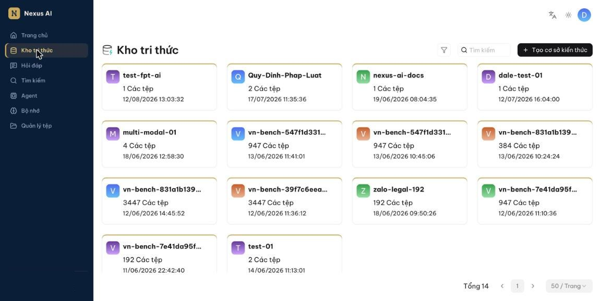
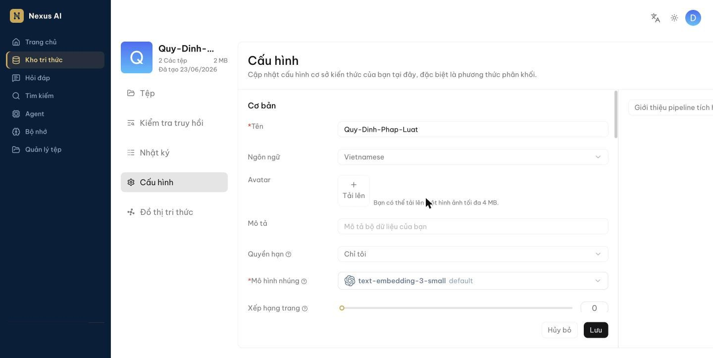
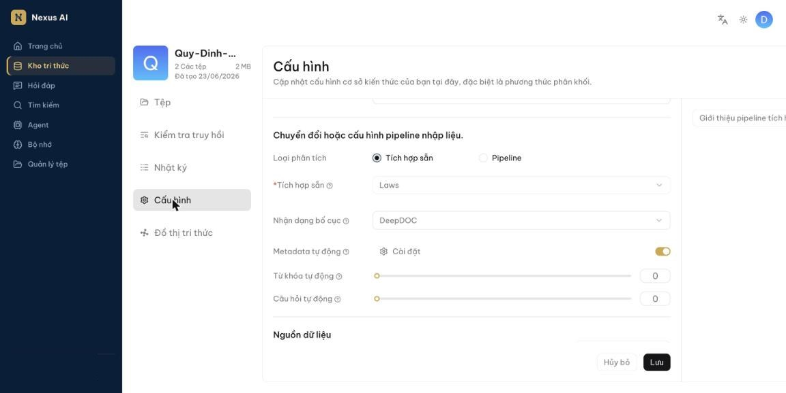
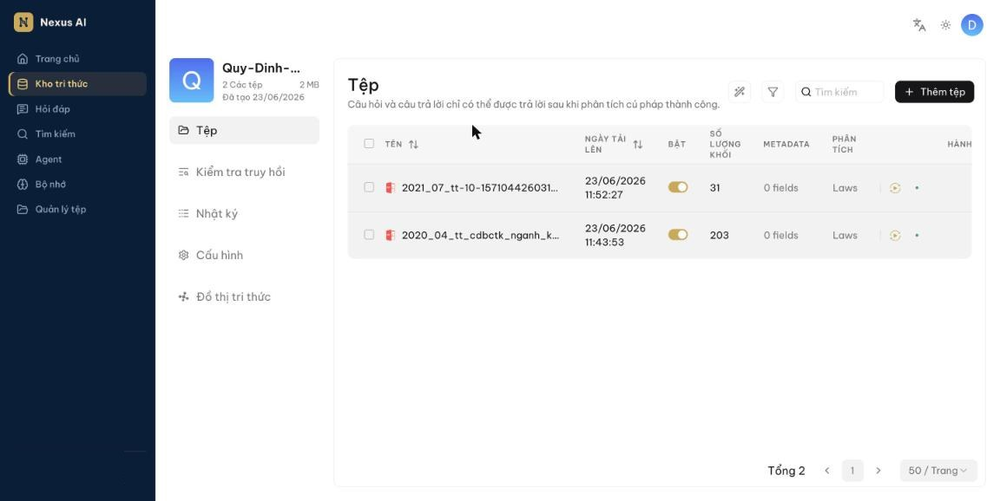
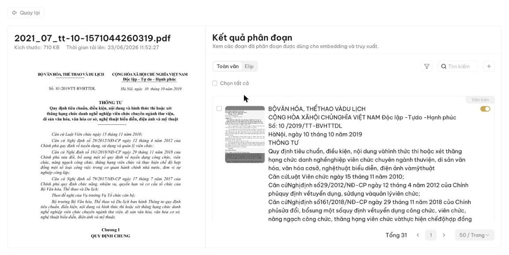

<!-- upstream: docs/guides/dataset/configure_knowledge_base.md @ 91f7edf -->

# Cấu hình kho tri thức

Hầu hết trợ lý hỏi đáp và Agent trong Nexus AI đều dựa trên kho tri thức. Mỗi kho tri thức là một nguồn kiến thức: các tệp bạn tải lên (hoặc liên kết từ **Quản lý tệp**) được *phân tích* thành tri thức thực sự cho các cuộc hỏi đáp về sau. Trang này hướng dẫn:

- Tạo kho tri thức
- Cấu hình kho tri thức
- Tải tệp lên và phân tích
- Tìm kho tri thức
- Xóa kho tri thức

## Tạo kho tri thức

Bạn có thể tạo nhiều kho tri thức để phục vụ nhiều mục đích hỏi đáp khác nhau. Để tạo kho tri thức:

1. Nhấn **Kho tri thức** ở thanh điều hướng bên trái, rồi nhấn **Tạo cơ sở kiến thức** ở góc trên bên phải.

    

2. Trong hộp thoại, nhập **Tên**, giữ **Mô hình nhúng** mặc định, chọn **Loại phân tích** là **Tích hợp sẵn** và chọn một phương thức phân khối (xem bảng bên dưới; **General** phù hợp cho hầu hết trường hợp). Nhấn **Lưu**.

    

## Cấu hình kho tri thức

Mở kho tri thức và chọn **Cấu hình** ở cột bên trái. Cấu hình này quyết định chất lượng hỏi đáp về sau: chọn sai mô hình nhúng hoặc sai phương thức phân khối sẽ làm mất ngữ nghĩa hoặc khiến câu trả lời không khớp.

Mục **Cơ bản** gồm **Tên**, **Ngôn ngữ** của tài liệu, **Avatar**, **Mô tả**, **Quyền hạn** (xem [Chia sẻ với nhóm](../nhom/chia-se.md)) và **Mô hình nhúng**. Kéo xuống là mục **pipeline nhập liệu** với phương thức phân khối và các tùy chọn phân tích.

### Chọn phương thức phân khối

Nexus AI có sẵn nhiều mẫu phân khối cho các bố cục tài liệu khác nhau, giúp giữ trọn ngữ nghĩa của từng khối. Trong mục **Loại phân tích**, chọn **Tích hợp sẵn** rồi chọn mẫu phù hợp với định dạng tệp của bạn:

| Mẫu | Mô tả | Định dạng tệp |
|-----|-------|---------------|
| General | Chia tệp thành các khối liên tiếp theo số token định trước. Phù hợp cho hầu hết trường hợp. | MD, MDX, DOCX, XLSX, XLS, PPT, PDF, TXT, JPEG, JPG, PNG, TIF, GIF, CSV, JSON, EML, HTML |
| Q&A | Tệp gồm các cặp câu hỏi – câu trả lời. | XLSX, XLS, CSV/TXT |
| Manual | Sổ tay hướng dẫn, tài liệu kỹ thuật có cấu trúc mục. | PDF |
| Table | Bảng dữ liệu; mỗi dòng thành một khối. | XLSX, XLS, CSV/TXT |
| Paper | Bài báo khoa học. | PDF |
| Book | Sách, tài liệu dài nhiều chương. | DOCX, PDF, TXT |
| Laws | Văn bản pháp luật, quy định, hợp đồng. | DOCX, PDF, TXT |
| Presentation | Bài trình chiếu; mỗi trang thành một khối. | PDF, PPTX |
| Picture | Hình ảnh (nhận dạng chữ trong ảnh). | JPEG, JPG, PNG, TIF, GIF |
| One | Mỗi tài liệu là một khối duy nhất. | DOCX, XLSX, XLS, PDF, TXT |
| Tag | Kho tri thức đóng vai trò bộ nhãn cho các kho khác. | XLSX, CSV/TXT |

Bạn cũng có thể đổi phương thức phân khối cho *từng tệp* ngay trên trang **Tệp** của kho tri thức (cột **Phân tích**).

Các tùy chọn khác trong mục này:

- **Nhận dạng bố cục**: cách trích xuất nội dung từ PDF. Xem [Chọn bộ phân tích PDF](chon-bo-phan-tich-pdf.md).
- **Metadata tự động**, **Từ khóa tự động**, **Câu hỏi tự động**: dùng mô hình ngôn ngữ để sinh thêm metadata, từ khóa và câu hỏi cho từng khối nhằm tăng khả năng tìm thấy. Tốn thêm thời gian và token khi phân tích; để mặc định nếu chưa cần.

??? info "Pipeline nạp dữ liệu tùy chỉnh"
    Ngoài các mẫu tích hợp sẵn, bạn có thể dùng một pipeline nạp dữ liệu do mình tự xây dựng trên trang **Agent** (loại *Luồng nạp dữ liệu*). Sau khi lưu pipeline, chọn **Loại phân tích** là **Pipeline** và chọn pipeline đó. Đây là tính năng nâng cao; nếu chưa cần, hãy dùng mẫu tích hợp sẵn.

### Chọn mô hình nhúng

Mô hình nhúng chuyển các khối văn bản thành vector để tìm kiếm theo ngữ nghĩa. **Không thể đổi mô hình nhúng khi kho tri thức đã có khối.** Muốn đổi, bạn phải xóa toàn bộ khối hiện có, vì mọi tệp trong cùng một kho *bắt buộc* phải được nhúng bằng cùng một mô hình.

Thông thường bạn chỉ cần giữ mô hình mặc định mà quản trị viên đã cấu hình.

!!! danger "Quan trọng"
    Một số mô hình nhúng được tối ưu cho ngôn ngữ nhất định. Dùng chúng cho tài liệu ngôn ngữ khác có thể làm giảm chất lượng.

Nhấn **Lưu** ở cuối trang sau khi thay đổi cấu hình.

## Tải tệp lên và phân tích

### Tải tệp lên

Có hai cách đưa tệp vào kho tri thức:

- **Liên kết từ Quản lý tệp**: tải tệp lên **Quản lý tệp** trước, rồi liên kết vào một hoặc nhiều kho tri thức. Kho tri thức chỉ giữ *tham chiếu* đến tệp.
- **Tải trực tiếp**: trên trang **Tệp** của kho tri thức, nhấn **Thêm tệp** để tải một hoặc nhiều tệp từ máy. Kho tri thức giữ *bản sao* của tệp.

Ngoài ra, tài liệu có thể tự động chảy vào kho tri thức từ một nguồn bên ngoài — xem [Đồng bộ OneDrive và SharePoint](dong-bo-onedrive-sharepoint.md).

Tải trực tiếp có vẻ tiện hơn, nhưng chúng tôi *khuyến nghị* tải lên **Quản lý tệp** rồi liên kết. Như vậy, khi xóa tệp khỏi kho tri thức hoặc xóa cả kho, tệp gốc vẫn còn.

### Phân tích tệp

Phân tích tệp gồm hai việc: chia tệp thành các khối theo bố cục và lập chỉ mục (nhúng vector + chỉ mục từ khóa) cho các khối đó. Sau khi đã chọn phương thức phân khối và mô hình nhúng:

1. Trên trang **Tệp**, tìm tệp vừa tải lên.
2. Nhấn biểu tượng chạy (▶) ở cột **Hành động** để bắt đầu phân tích.
3. Theo dõi trạng thái cho đến khi hoàn tất; cột **Số lượng khối** hiển thị số khối đã tạo.

    

- Cột **Phân tích** cho phép chọn phương thức phân khối riêng cho từng tệp, khác với mặc định của kho tri thức.
- Công tắc **Bật** cho phép tạm loại tệp đó khỏi hỏi đáp mà không cần xóa.

!!! note "Phân tích mất bao lâu?"
    Tùy kích thước và loại tệp. PDF có nhiều hình, bảng hoặc chữ dạng ảnh mất nhiều thời gian hơn vì phải nhận dạng ký tự và bố cục. Xem thêm [Chọn bộ phân tích PDF](chon-bo-phan-tich-pdf.md).

### Can thiệp vào kết quả phân tích

Nexus AI cho phép xem và chỉnh sửa kết quả phân khối:

1. Nhấn vào tên tệp đã phân tích xong để mở trang **Kết quả phân đoạn**: bên trái là tài liệu gốc, bên phải là các khối.

    

2. Chuyển giữa chế độ **Toàn văn** và **Elip** (rút gọn) để xem nhanh nội dung từng khối.
3. Nhấn vào một khối để sửa nội dung, thêm từ khóa hoặc câu hỏi; nhấn **+** để thêm khối mới. Công tắc bên phải mỗi khối cho phép tạm tắt khối đó.

!!! tip "Mẹo"
    Thêm từ khóa cho một khối sẽ tăng thứ hạng của khối đó với các câu hỏi chứa từ khóa ấy.

4. Sang trang **Kiểm tra truy hồi**, nhập một câu hỏi để xác nhận cấu hình hoạt động đúng. Xem chi tiết tại [Kiểm tra truy hồi](kiem-tra-truy-hoi.md).

## Tìm kho tri thức

Ô **Tìm kiếm** trên trang **Kho tri thức** hiện chỉ hỗ trợ tìm theo tên.

## Xóa kho tri thức

Di chuột lên thẻ kho tri thức, nhấn biểu tượng ba chấm rồi chọn **Xóa**. Khi xóa kho tri thức:

- Các tệp tải trực tiếp vào kho sẽ bị xóa theo.
- Các tệp *liên kết* từ **Quản lý tệp** chỉ mất liên kết; tệp gốc vẫn còn.
