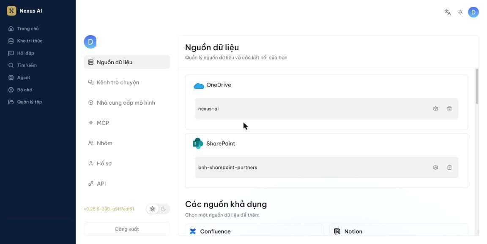
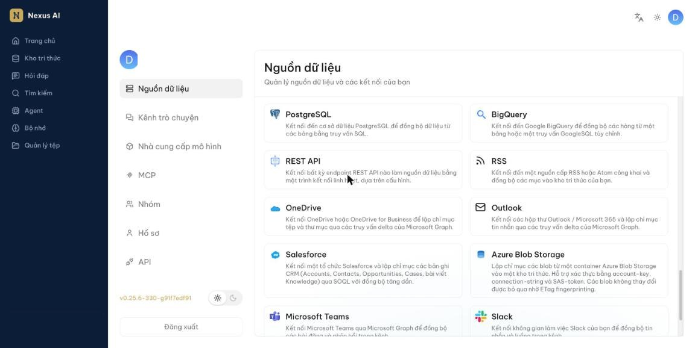
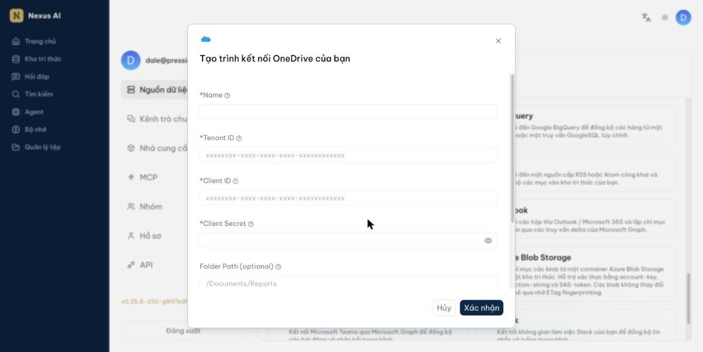
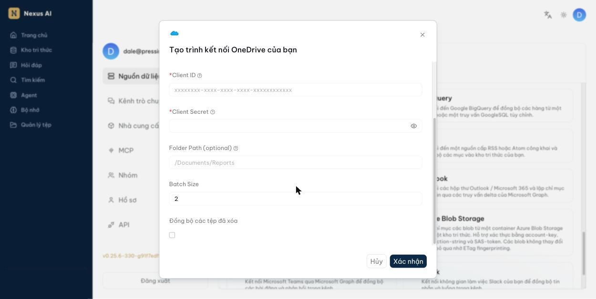
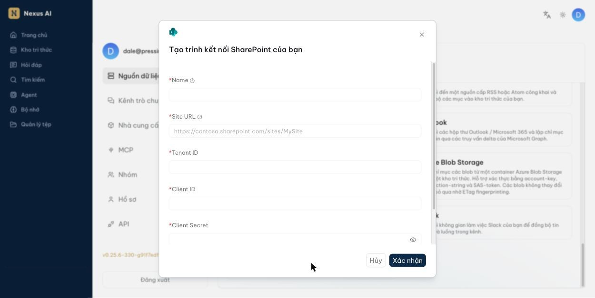
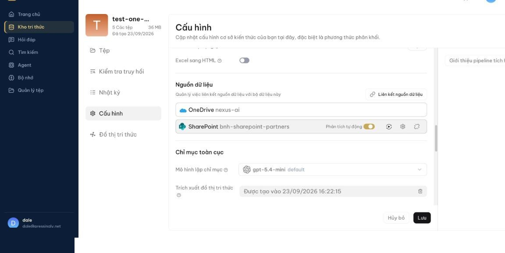
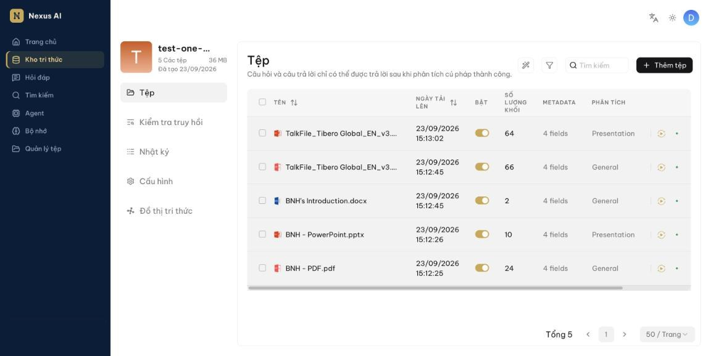
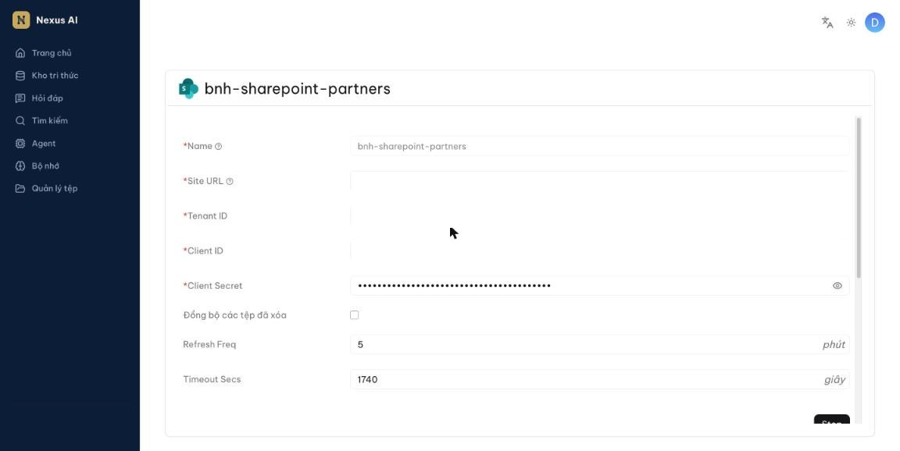

<!-- upstream: không có trang tương ứng; viết mới từ giao diện Nexus AI @ 91f7edf -->

# Đồng bộ OneDrive và SharePoint

Kết nối OneDrive hoặc SharePoint làm nguồn dữ liệu để tài liệu tự động chảy vào kho tri thức, thay vì phải tải lên thủ công từng tệp.

---

## Cách hoạt động

1. Bạn tạo một **nguồn dữ liệu** bằng thông tin kết nối do quản trị viên Microsoft 365 cấp.
2. Bạn **liên kết** nguồn dữ liệu đó với một kho tri thức.
3. Hệ thống tự động tải tài liệu về theo chu kỳ bạn đặt (mặc định 5 phút một lần).
4. Mỗi tài liệu được *phân tích* thành các khối và đưa vào kho tri thức, sẵn sàng cho hỏi đáp.

Sau lần đầu, các lần sau chỉ tải về phần thay đổi, nên đồng bộ rất nhanh.

## Điều kiện

Bạn cần xin quản trị viên Microsoft 365 của tổ chức bốn thông tin sau. Đây là thông tin của một *ứng dụng đăng ký* trên Azure, không phải tài khoản cá nhân của bạn:

| Thông tin | Dùng cho | Ghi chú |
|---|---|---|
| **Tenant ID** | Cả hai | Mã định danh tổ chức, dạng `xxxxxxxx-xxxx-xxxx-xxxx-xxxxxxxxxxxx` |
| **Client ID** | Cả hai | Mã định danh ứng dụng, cùng dạng như trên |
| **Client Secret** | Cả hai | Chuỗi bí mật, **không phải** mã GUID |
| **Site URL** | Chỉ SharePoint | Ví dụ `https://contoso.sharepoint.com/sites/MySite` |

Ứng dụng đó phải được cấp quyền `Files.Read.All` (cho OneDrive) hoặc cả `Sites.Read.All` và `Files.Read.All` (cho SharePoint), và phải được quản trị viên chấp thuận.

!!! danger "Quan trọng"
    Khi tạo Client Secret, Azure hiển thị **hai** giá trị: một *Value* (chuỗi ngẫu nhiên khoảng 40 ký tự) và một *Secret ID* (dạng GUID có 4 dấu gạch nối). Nexus AI cần **Value**. Dán nhầm Secret ID là lỗi phổ biến nhất và sẽ khiến kết nối thất bại. Azure chỉ hiển thị Value đúng một lần lúc tạo — nếu đã đóng cửa sổ, phải tạo secret mới.

## Tạo nguồn dữ liệu OneDrive

1. Nhấn vào ảnh đại diện ở góc trên bên phải, chọn **Nguồn dữ liệu**. Trang này liệt kê các nguồn bạn đã tạo ở trên, và **Các nguồn khả dụng** ở dưới.

    

2. Cuộn xuống **Các nguồn khả dụng** và nhấn thẻ **OneDrive**.

    

3. Trong hộp thoại **Tạo trình kết nối OneDrive của bạn**, điền:

    - **Name** — tên gợi nhớ, do bạn tự đặt.
    - **Tenant ID**, **Client ID**, **Client Secret** — dán từ thông tin quản trị viên cấp.

    

4. Cuộn xuống để xem các tùy chọn còn lại. Có thể để nguyên tất cả:

    - **Folder Path** — để trống thì lập chỉ mục toàn bộ ổ đĩa. Điền đường dẫn như `/Documents/Reports` nếu chỉ muốn một thư mục con.
    - **Batch Size** — số tài liệu xử lý mỗi đợt.
    - **Đồng bộ các tệp đã xóa** — bật nếu muốn tệp bị xóa trên OneDrive cũng biến mất khỏi kho tri thức.

    Nhấn **Xác nhận**.

    

## Tạo nguồn dữ liệu SharePoint

Các bước giống hệt OneDrive, chỉ khác ở hộp thoại: SharePoint có thêm ô **Site URL** và không có **Folder Path**.

1. Ở **Các nguồn khả dụng**, nhấn thẻ **SharePoint**.
2. Điền **Name**, **Site URL**, rồi **Tenant ID**, **Client ID**, **Client Secret**. Nhấn **Xác nhận**.

    

!!! tip "Mẹo"
    Một nguồn SharePoint chỉ đọc **một** trang. Nếu tài liệu nằm ở nhiều trang SharePoint khác nhau, hãy tạo nhiều nguồn dữ liệu, mỗi nguồn một **Site URL**, rồi liên kết tất cả vào cùng một kho tri thức.

## Liên kết vào kho tri thức

1. Mở kho tri thức, chọn **Cấu hình** ở cột bên trái, cuộn xuống mục **Nguồn dữ liệu**.
2. Nhấn **Liên kết nguồn dữ liệu**, chọn nguồn vừa tạo.
3. Rê chuột vào dòng nguồn dữ liệu để hiện các nút thao tác:

    - **Phân tích tự động** — bật để tài liệu tải về được phân tích ngay. Nên để bật.
    - Nút ▶ — tải lại toàn bộ tài liệu từ nguồn và phân tích lại từ đầu.
    - Nút bánh răng — mở trang cài đặt của nguồn.
    - Nút cuối — bỏ liên kết nguồn khỏi kho tri thức.

    

4. Nhấn **Lưu**.

!!! warning "Lưu ý"
    Lần đồng bộ đầu tiên không chạy ngay lập tức. Hệ thống chờ hết một chu kỳ (mặc định 5 phút) rồi mới bắt đầu, nên trang **Tệp** trống trong vài phút đầu là bình thường.

## Kiểm tra kết quả

Mở kho tri thức, chọn **Tệp** ở cột bên trái. Tài liệu đồng bộ về sẽ xuất hiện trong danh sách, kèm **Số lượng khối** cho biết đã phân tích xong.

Cột **Bật** cho biết tài liệu có được dùng khi hỏi đáp hay không. Nếu **Số lượng khối** vẫn là 0 sau một lúc lâu, tài liệu chưa phân tích xong hoặc phân tích thất bại — mở **Nhật ký** ở cột bên trái để xem chi tiết.

## Đổi tần suất đồng bộ

Vào **Nguồn dữ liệu**, nhấn nút bánh răng ở nguồn cần sửa:

- **Refresh Freq** — bao lâu đồng bộ một lần, tính bằng **phút**.
- **Timeout Secs** — thời gian tối đa cho một lần đồng bộ, tính bằng **giây**.

## Câu hỏi thường gặp

### Đồng bộ báo thành công nhưng không có tài liệu nào?

Thường gặp nhất là **chọn nhầm loại nguồn**. Nguồn **OneDrive** chỉ thấy được các thư viện tài liệu dùng chung ở cấp tổ chức; nó **không** thấy tài liệu nằm trong các trang SharePoint. Nếu tài liệu của bạn ở một trang SharePoint, hãy tạo nguồn **SharePoint** với **Site URL** của trang đó.

Khả năng thứ hai: thư mục chỉ chứa các định dạng không được hỗ trợ (xem câu hỏi bên dưới).

### Những định dạng nào được đồng bộ?

Nguồn **OneDrive** chỉ lấy các tệp `.pdf`, `.doc`, `.docx`, `.xls`, `.xlsx`, `.ppt`, `.pptx`, `.txt`, `.md`, `.csv`. Các tệp khác bị bỏ qua hoàn toàn.

Nguồn **SharePoint** lấy mọi tệp trong thư viện tài liệu của trang.

### Tài liệu sửa trên OneDrive thì kho tri thức có cập nhật không?

Có. Mỗi chu kỳ đồng bộ, hệ thống lấy về phần thay đổi và phân tích lại tài liệu đó. Riêng tệp bị **xóa** chỉ được gỡ khỏi kho tri thức nếu bạn đã bật **Đồng bộ các tệp đã xóa**.

### Tôi có phải nhập lại thông tin kết nối cho mỗi kho tri thức không?

Không. Một nguồn dữ liệu tạo một lần, sau đó liên kết được vào nhiều kho tri thức khác nhau.

### Bỏ liên kết nguồn thì tài liệu đã đồng bộ có mất không?

Không. Tài liệu đã tải về vẫn nằm trong kho tri thức, chỉ ngừng cập nhật thêm.
