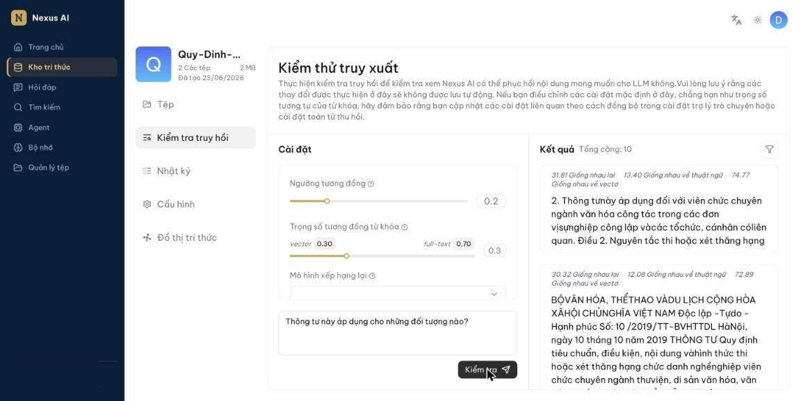

<!-- upstream: docs/guides/dataset/run_retrieval_test.md @ 91f7edf -->

# Kiểm tra truy hồi

Kiểm tra xem kho tri thức có tìm được đúng khối nội dung mong muốn hay không.

---

Sau khi tải lên và phân tích tệp, bạn nên chạy kiểm tra truy hồi *trước khi* cấu hình trợ lý hỏi đáp. Đây không phải bước thừa: cấu hình kho tri thức, cấu hình trợ lý và mô hình được dùng đều ảnh hưởng lớn đến kết quả cuối. Kiểm tra truy hồi xác nhận rằng các khối đúng có thể được tìm thấy, giúp bạn khoanh vùng vấn đề nhanh. Ví dụ, nếu biết chắc khối đúng đã được truy hồi mà câu trả lời vẫn sai, vấn đề nằm ở mô hình hoặc prompt chứ không phải ở dữ liệu.

Khi kiểm tra, các khối được tìm bằng *tìm kiếm lai*: kết hợp độ tương đồng từ khóa (full-text) có trọng số với độ tương đồng vector có trọng số (hoặc điểm xếp hạng lại, nếu bạn chọn mô hình rerank).

## Điều kiện

- Tệp đã được tải lên và phân tích thành công.
- Nếu muốn bật **Sử dụng đồ thị tri thức**, đồ thị tri thức phải được xây dựng xong trước.

## Các tham số

### Ngưỡng tương đồng

Khối có độ tương đồng thấp hơn ngưỡng sẽ bị loại. Mặc định 0.2, nghĩa là chỉ những khối có điểm tương đồng lai từ 20 trở lên mới được truy hồi.

### Trọng số tương đồng từ khóa

Thanh trượt hiển thị hai phần: *vector* và *full-text* (từ khóa), tổng luôn bằng 1. Mặc định vector 0.30 / full-text 0.70.

- Tăng phần vector khi câu hỏi diễn đạt khác với từ ngữ trong tài liệu (tìm theo ý nghĩa).
- Tăng phần full-text khi bạn cần khớp chính xác thuật ngữ, mã số, tên riêng.

### Mô hình xếp hạng lại

- Để trống: dùng độ tương đồng từ khóa kết hợp độ tương đồng vector.
- Chọn mô hình: dùng độ tương đồng từ khóa kết hợp điểm xếp hạng lại.

!!! danger "Quan trọng"
    Dùng mô hình xếp hạng lại làm tăng đáng kể thời gian nhận kết quả.

### Sử dụng đồ thị tri thức

Chỉ có tác dụng khi kho tri thức đã xây dựng đồ thị tri thức. Khi bật, hệ thống dùng mô hình ngôn ngữ để trích xuất thực thể từ câu hỏi và tìm thêm các thực thể, quan hệ liên quan trong đồ thị.

!!! danger "Quan trọng"
    Dùng đồ thị tri thức làm tăng đáng kể thời gian nhận kết quả và tiêu tốn thêm token.

### Tìm kiếm đa ngôn ngữ

Chọn một hoặc nhiều ngôn ngữ đích, hệ thống sẽ dịch câu hỏi sang các ngôn ngữ đó trước khi tìm. Hữu ích khi tài liệu có nhiều ngôn ngữ.

!!! tip "Mẹo"
    - Chỉ chọn ngôn ngữ thực sự có trong kho tri thức.
    - Không chọn gì thì hệ thống chỉ tìm theo ngôn ngữ của câu hỏi; nội dung ngôn ngữ khác có thể bị bỏ sót.

## Các bước

1. Mở kho tri thức, chọn **Kiểm tra truy hồi** ở cột bên trái.
2. Nhập câu hỏi vào ô văn bản rồi nhấn **Kiểm tra**.
3. Xem danh sách khối trả về ở cột **Kết quả**, mỗi khối kèm điểm *giống nhau lai*, *thuật ngữ* và *vectơ*. Nếu kết quả chưa như ý, điều chỉnh các tham số ở trên và chạy lại.

    

    *Ví dụ trong hình: điểm lai 31.81 = 13.40 (thuật ngữ) × 0.7 + 74.77 (vectơ) × 0.3.*

!!! warning "Lưu ý"
    Các tham số bạn điều chỉnh ở trang này **không tự lưu** vào trợ lý hỏi đáp. Sau khi tìm được bộ tham số tốt, hãy nhập lại chúng trong **Cài đặt nâng cao** của trợ lý hỏi đáp (hoặc thành phần **Truy xuất** của Agent).

## Câu hỏi thường gặp

### Bật "Sử dụng đồ thị tri thức" có gọi mô hình ngôn ngữ không?

Có. Mô hình ngôn ngữ được dùng để phân tích câu hỏi và trích xuất thực thể, quan hệ. Vì vậy thời gian và token tiêu tốn tăng lên.
