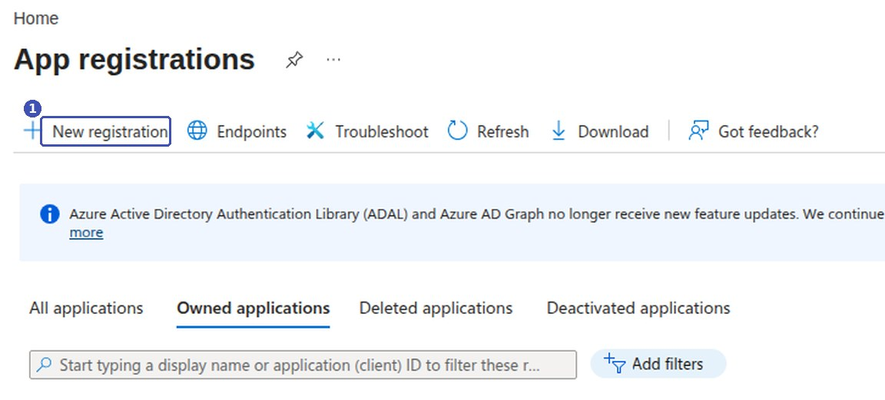
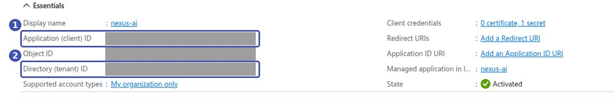
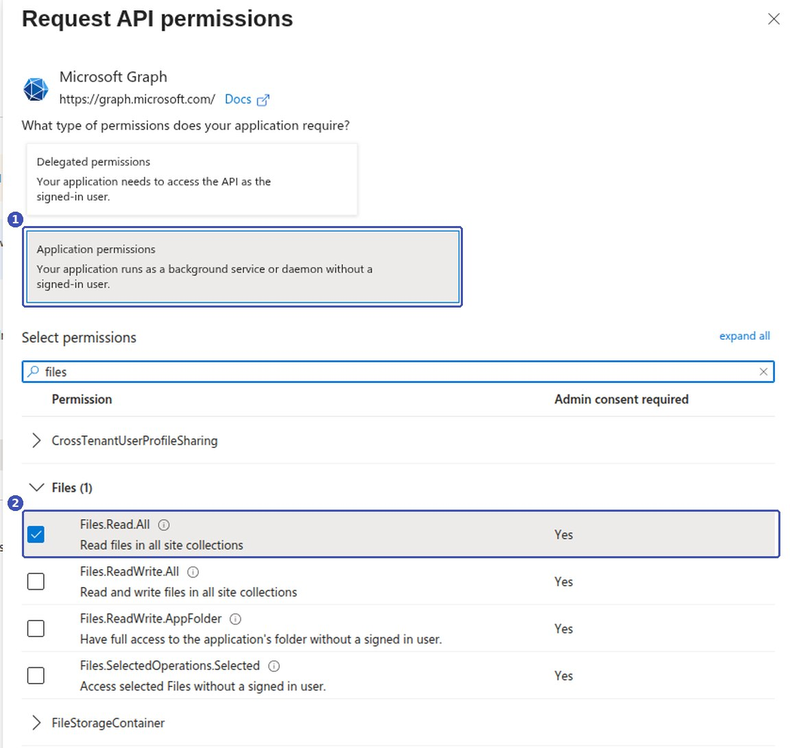
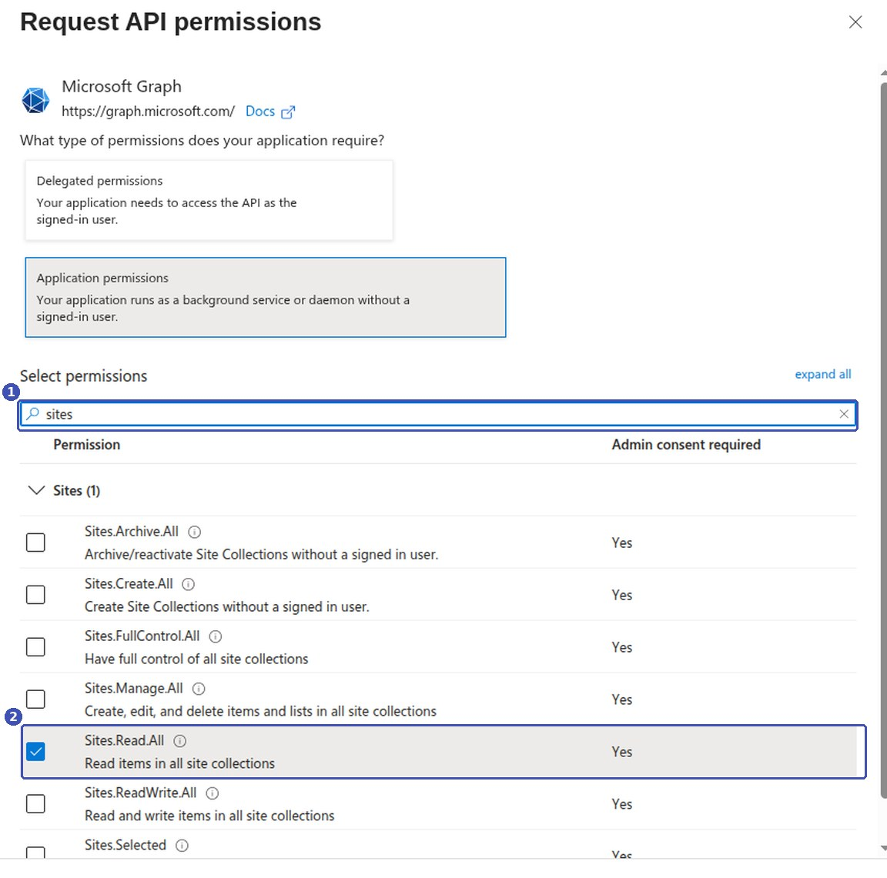
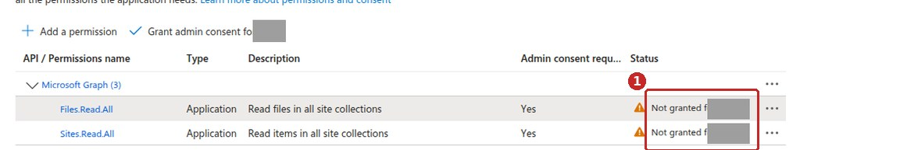
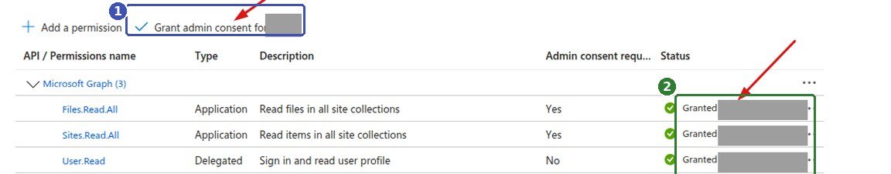
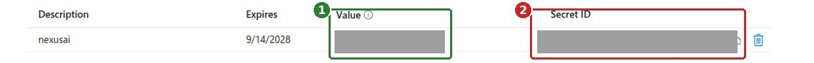

<!-- upstream: không có trang tương ứng; viết mới từ ảnh chụp Azure Portal, đối chiếu common/data_source/{onedrive,sharepoint}_connector.py @ 91f7edf -->

# Lấy khoá kết nối Microsoft 365

Trang này hướng dẫn **quản trị viên Microsoft 365** tạo một ứng dụng trên Azure để lấy ba giá trị mà Nexus AI cần khi kết nối OneDrive hoặc SharePoint: **Tenant ID**, **Client ID** và **Client Secret**.

!!! note "Về các ảnh minh hoạ"
    Khung màu và số thứ tự trên ảnh là chú thích của tài liệu, không phải giao diện Azure. Các ô xám là thông tin riêng của tổ chức đã được che.

---

## Ai cần đọc trang này

Chỉ quản trị viên Microsoft 365 của tổ chức làm được các bước dưới đây, vì bước cấp quyền đòi hỏi quyền quản trị. Người dùng thường chỉ cần xin ba giá trị đã tạo xong rồi làm theo [Đồng bộ OneDrive và SharePoint](onedrive-sharepoint.md).

Bạn chỉ phải làm **một lần**. Một ứng dụng dùng chung được cho mọi nguồn dữ liệu OneDrive và SharePoint sau này.

## Vì sao cần ứng dụng riêng

Nexus AI đồng bộ tài liệu chạy nền theo chu kỳ, không có người ngồi đăng nhập ở mỗi lần chạy. Vì vậy nó không dùng tài khoản cá nhân của bạn mà dùng một *ứng dụng* có danh tính riêng, được tổ chức cấp quyền đọc tài liệu.

Toàn bộ quy trình gồm năm bước:

1. Đăng ký ứng dụng.
2. Lấy **Client ID** và **Tenant ID**.
3. Cấp quyền đọc tài liệu cho ứng dụng.
4. Chấp thuận quyền với tư cách quản trị viên.
5. Tạo **Client Secret**.

## Bước 1 — Đăng ký ứng dụng

1. Mở [portal.azure.com](https://portal.azure.com), tìm và mở **Microsoft Entra ID** (tên cũ là Azure Active Directory).
2. Ở cột bên trái chọn **App registrations**, rồi nhấn **New registration**.

    

3. Điền biểu mẫu:

    - **Name** — tên gợi nhớ, ví dụ `nexus-ai`. Tên này chỉ hiển thị trong Azure.
    - **Supported account types** — chọn **Accounts in this organizational directory only**.
    - **Redirect URI** — **để trống**. Nexus AI không dùng luồng đăng nhập qua trình duyệt nên không cần mục này.

4. Nhấn **Register**.

## Bước 2 — Lấy Client ID và Tenant ID

Sau khi đăng ký, Azure mở thẳng trang **Overview** của ứng dụng. Hai giá trị bạn cần nằm ngay trong khung **Essentials**:

| Nhãn trên Azure | Ô tương ứng trong Nexus AI |
|---|---|
| **Application (client) ID** | **Client ID** |
| **Directory (tenant) ID** | **Tenant ID** |

Cả hai đều có dạng `xxxxxxxx-xxxx-xxxx-xxxx-xxxxxxxxxxxx`. Rê chuột vào giá trị rồi nhấn biểu tượng chép để lấy nguyên văn.

!!! note "Object ID thì sao?"
    Khung Essentials còn một dòng **Object ID** rất giống hai giá trị trên. Nexus AI **không** dùng giá trị này — đừng chép nhầm.

## Bước 3 — Cấp quyền đọc tài liệu

1. Ở cột bên trái của ứng dụng, chọn **API permissions**, rồi nhấn **Add a permission**.
2. Chọn **Microsoft Graph**.
3. Khi Azure hỏi *What type of permissions does your application require?*, chọn **Application permissions**.
4. Gõ `files` vào ô tìm kiếm, mở nhóm **Files**, tích **Files.Read.All**, rồi nhấn **Add permissions**.

    

5. Nếu tổ chức dùng SharePoint, nhấn **Add a permission** lần nữa, cũng chọn **Microsoft Graph > Application permissions**, gõ `sites`, tích **Sites.Read.All** rồi **Add permissions**.

    

Tóm tắt quyền cần cấp:

| Quyền | Loại | Cần cho |
|---|---|---|
| **Files.Read.All** | Application | OneDrive **và** SharePoint |
| **Sites.Read.All** | Application | Chỉ SharePoint |

!!! danger "Phải là Application permissions, không phải Delegated"
    Đây là lỗi hay gặp nhất ở bước này. **Delegated permissions** chỉ hoạt động khi có người dùng thật đang đăng nhập — mà Nexus AI thì chạy nền. Chọn nhầm Delegated, ứng dụng vẫn tạo được nhưng mọi lần đồng bộ đều thất bại vì thiếu quyền. Kiểm tra lại: ở bảng quyền, cột **Type** phải ghi `Application`.

!!! tip "Nên cấp cả hai quyền ngay từ đầu"
    Nếu chưa chắc sau này có dùng SharePoint hay không, cứ cấp cả **Files.Read.All** và **Sites.Read.All**. Cả hai đều là quyền *chỉ đọc*, và cấp sẵn thì đỡ phải quay lại làm lại bước chấp thuận.

## Bước 4 — Chấp thuận quyền

Quyền vừa thêm **chưa có hiệu lực**. Ở bảng **Configured permissions**, cột **Status** đang hiện cảnh báo ⚠️ *Not granted for …*:

Nhấn **Grant admin consent for …** ngay phía trên bảng, rồi xác nhận **Yes**. Cột **Status** chuyển sang ✅ *Granted for …* màu xanh:

!!! warning "Bỏ qua bước này là kết nối chắc chắn hỏng"
    Không có dấu ✅ xanh ở cả hai dòng quyền thì Nexus AI sẽ báo lỗi thiếu quyền khi đồng bộ, dù Tenant ID, Client ID và Client Secret đều đúng.

Nếu nút **Grant admin consent** bị mờ, tài khoản của bạn không đủ quyền quản trị — cần nhờ một Global Administrator hoặc Privileged Role Administrator bấm giúp.

## Bước 5 — Tạo Client Secret

1. Ở cột bên trái, chọn **Certificates & secrets**, mở tab **Client secrets**, rồi nhấn **New client secret**.
2. Điền **Description** (tên gợi nhớ) và chọn **Expires** — thời hạn của secret.
3. Nhấn **Add**.

Azure hiện một dòng mới với hai cột dễ nhầm:

| Cột | Nội dung | Dùng không? |
|---|---|---|
| **Value** | Chuỗi ngẫu nhiên khoảng 40 ký tự | ✅ Đây là **Client Secret** |
| **Secret ID** | Mã dạng `xxxxxxxx-xxxx-…` có 4 dấu gạch nối | ❌ Không dùng |

!!! danger "Chép Value ngay lập tức"
    Azure chỉ hiện đầy đủ **Value** đúng một lần, ngay sau khi tạo. Rời trang hoặc tải lại là nó bị che vĩnh viễn, chỉ còn vài ký tự đầu — như trong ảnh trên. Lúc đó không có cách nào xem lại, bắt buộc phải xoá secret cũ và tạo secret mới.

!!! warning "Secret có hạn dùng"
    Đến ngày hết hạn ở cột **Expires**, mọi nguồn dữ liệu dùng secret đó sẽ ngừng đồng bộ. Hãy ghi lại ngày này và tạo secret mới trước khi hết hạn.

## Bàn giao cho người dùng

Gửi cho người sẽ tạo nguồn dữ liệu ba giá trị sau:

| Giá trị | Lấy ở đâu |
|---|---|
| **Tenant ID** | Overview → Directory (tenant) ID |
| **Client ID** | Overview → Application (client) ID |
| **Client Secret** | Certificates & secrets → cột **Value** |

Riêng SharePoint, người dùng cần thêm **Site URL** của trang chứa tài liệu, dạng `https://contoso.sharepoint.com/sites/MySite`.

Các bước tiếp theo nằm ở [Đồng bộ OneDrive và SharePoint](onedrive-sharepoint.md).

!!! tip "Client Secret là mật khẩu"
    Ai có ba giá trị này đều đọc được toàn bộ tài liệu trong phạm vi đã cấp quyền. Gửi qua kênh an toàn, đừng dán vào chat nhóm hay email thường.

## Câu hỏi thường gặp

### Có phải tạo hai ứng dụng riêng cho OneDrive và SharePoint không?

Không. Một ứng dụng có đủ cả **Files.Read.All** và **Sites.Read.All** dùng được cho mọi nguồn dữ liệu OneDrive lẫn SharePoint.

### Đồng bộ báo sai thông tin đăng nhập?

Kiểm tra theo thứ tự:

1. **Client Secret** có phải cột **Value** không, hay đã chép nhầm **Secret ID**.
2. Secret đã hết hạn chưa — xem cột **Expires**.
3. **Client ID** và **Tenant ID** có bị chép nhầm sang **Object ID** không.

### Đồng bộ báo thiếu quyền?

Thông tin đăng nhập đã đúng, vấn đề nằm ở quyền. Mở lại **API permissions** và kiểm tra:

- Cột **Type** của cả hai dòng quyền phải là `Application`, không phải `Delegated`.
- Cột **Status** phải là ✅ *Granted*, không còn cảnh báo ⚠️.

### Secret sắp hết hạn thì làm gì?

Tạo secret mới ở **Certificates & secrets** trước ngày hết hạn, chép **Value** mới, rồi cập nhật vào từng nguồn dữ liệu trong Nexus AI. Xoá secret cũ sau khi đã xác nhận đồng bộ chạy bình thường.

### Tại sao phải cấp quyền đọc *toàn bộ* tài liệu?

Hai quyền `Files.Read.All` và `Sites.Read.All` là mức nhỏ nhất mà Microsoft Graph cung cấp cho ứng dụng chạy nền — Microsoft không có quyền giới hạn theo từng thư mục. Nếu chỉ muốn lập chỉ mục một phần, hãy giới hạn ở phía Nexus AI bằng ô **Folder Path** (OneDrive) hoặc **Site URL** (SharePoint) khi tạo nguồn dữ liệu.
