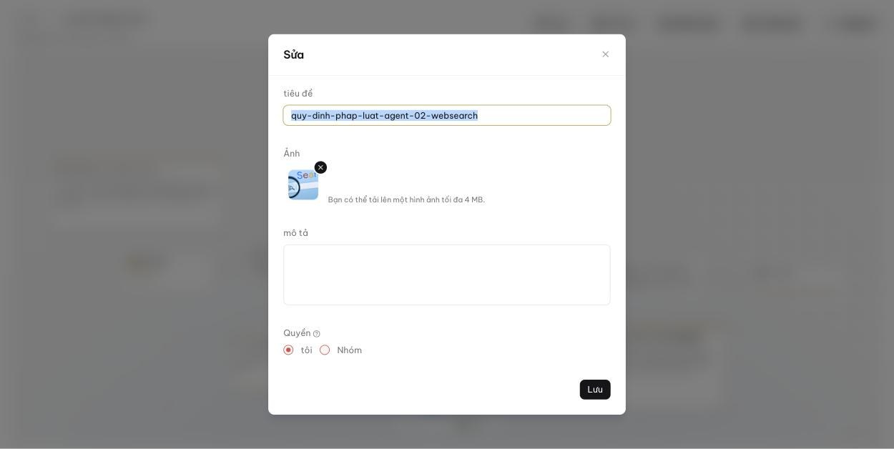

<!-- upstream: docs/guides/team/share_knowledge_bases.md, docs/guides/team/share_agents.md @ 91f7edf -->

# Chia sẻ với nhóm

Chia sẻ kho tri thức và Agent để thành viên nhóm cùng sử dụng.

---

Kho tri thức và Agent **không tự động** được chia sẻ. Bạn phải bật chia sẻ cho từng mục bằng cách đổi quyền từ **Chỉ tôi** sang **Nhóm**.

## Chia sẻ kho tri thức

1. Mở kho tri thức, chọn **Cấu hình** ở cột bên trái.
2. Trong mục **Cơ bản**, đổi **Quyền hạn** từ **Chỉ tôi** sang **Nhóm**.
3. Nhấn **Lưu**.

*Thành viên nhóm sẽ thấy kho tri thức này trong danh sách của họ, có thể tải tài liệu lên và phân tích.*

## Chia sẻ Agent

1. Trên trang **Agent**, nhấn vào Agent cần chia sẻ để mở trình soạn thảo.
2. Nhấn **Quản lý** > **Cài đặt**.
3. Đổi **Quyền** từ **tôi** sang **Nhóm**.
4. Nhấn **Lưu**.

*Thành viên nhóm sẽ thấy và dùng được Agent này.*

## Chia sẻ trợ lý hỏi đáp

Hiện chưa hỗ trợ chia sẻ trợ lý hỏi đáp giữa các thành viên. Cách thay thế: chia sẻ kho tri thức, mỗi thành viên tự tạo trợ lý của mình gắn với kho đó.

!!! note
    Chia sẻ không cấp quyền xóa: chỉ chủ sở hữu mới xóa được kho tri thức hoặc Agent.
