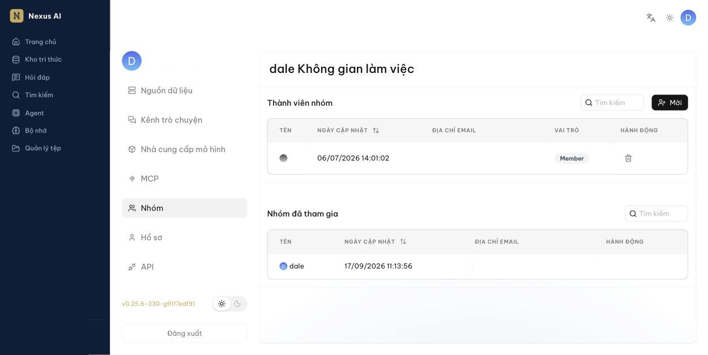

<!-- upstream: docs/guides/team/join_or_leave_team.md @ 91f7edf -->

# Tham gia hoặc rời nhóm

Chấp nhận lời mời vào nhóm, từ chối lời mời, hoặc rời nhóm đã tham gia.

---

Khi tham gia một nhóm, bạn có thể:

- Sử dụng và tải tài liệu lên các kho tri thức mà chủ nhóm đã chia sẻ.
- Phân tích tài liệu trong các kho tri thức được chia sẻ.
- Sử dụng các Agent mà chủ nhóm đã chia sẻ.

!!! tip
    Chỉ chủ nhóm mới mời được thành viên (nút **Mời** trong mục **Thành viên nhóm**). Nếu bạn cần mời đồng nghiệp, hãy liên hệ chủ nhóm hoặc quản trị viên.

## Điều kiện

- Email nhận lời mời phải trùng với email tài khoản Nexus AI của bạn.
- Chủ nhóm đã đặt **Quyền hạn** của kho tri thức thành **Nhóm** (xem [Chia sẻ với nhóm](chia-se.md)).

## Chấp nhận hoặc từ chối lời mời

1. Nhấn vào ảnh đại diện ở góc trên bên phải để mở **Cài đặt người dùng**, rồi chọn **Nhóm** ở cột bên trái.

    

2. Mục **Thành viên nhóm** liệt kê nhóm do bạn làm chủ; mục **Nhóm đã tham gia** liệt kê các nhóm bạn được mời hoặc đã tham gia.
3. Với lời mời đang chờ, nhấn **Đồng ý** để tham gia hoặc **Từ chối**.

*Sau khi tham gia, các kho tri thức và Agent được chia sẻ của nhóm sẽ xuất hiện trong danh sách của bạn.*

## Rời nhóm

Trong mục **Nhóm đã tham gia**, nhấn **Rời khỏi** ở cột **Hành động** bên cạnh nhóm và xác nhận. Bạn sẽ không còn thấy các kho tri thức và Agent được chia sẻ của nhóm đó.
