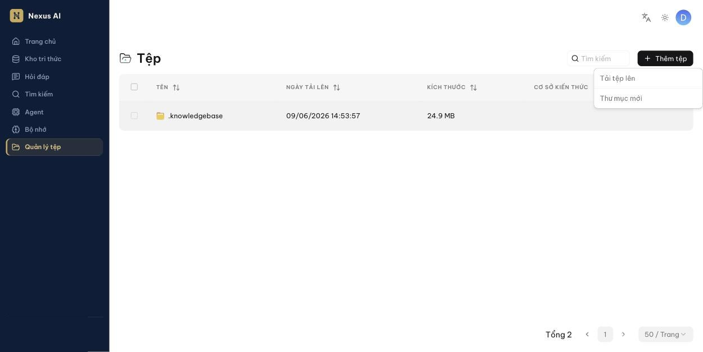
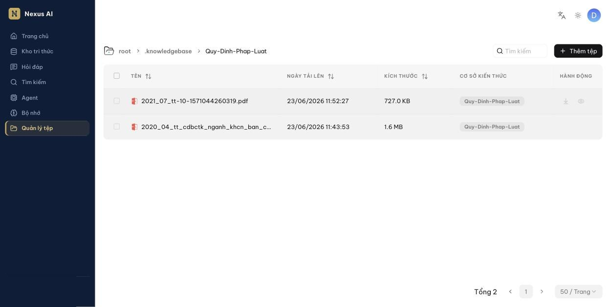

<!-- upstream: docs/guides/manage_files.md @ 91f7edf -->

# Quản lý tệp

Tải tệp lên kho tệp trung tâm và liên kết vào nhiều kho tri thức.

---

**Quản lý tệp** cho phép tải tệp lên từng cái hoặc hàng loạt, sắp xếp theo thư mục, rồi *liên kết* một tệp vào nhiều kho tri thức.

!!! info "Vì sao nên tải lên Quản lý tệp thay vì tải thẳng vào kho tri thức?"
    Khi tệp nằm trong **Quản lý tệp**, kho tri thức chỉ giữ tham chiếu. Bạn có thể xóa tệp khỏi một kho tri thức, hoặc xóa cả kho, mà tệp gốc vẫn còn để dùng lại.

## Tải tệp lên và tạo thư mục

Nhấn **Quản lý tệp** ở thanh điều hướng bên trái, rồi nhấn **Thêm tệp**:

- **Tải tệp lên**: kéo thả hoặc chọn một hay nhiều tệp từ máy.
- **Thư mục mới**: tạo thư mục; thư mục có thể lồng nhau.

!!! warning "Lưu ý"
    Mỗi kho tri thức có một thư mục tương ứng trong **.knowledgebase**. Bạn không thể tạo thư mục con bên trong đó.

## Xem danh sách tệp

Bảng liệt kê **Tên**, **Ngày tải lên**, **Kích thước**, **Cơ sở kiến thức** (các kho tri thức mà tệp đã được liên kết) và **Hành động**. Di chuột lên một dòng để hiện các nút thao tác.

## Xem trước tệp

Nhấn biểu tượng con mắt trong cột **Hành động** để xem trước. Hỗ trợ:

- Tài liệu: PDF, DOCX
- Bảng tính: XLSX
- Hình ảnh: JPEG, JPG, PNG, TIF, GIF

## Liên kết tệp vào kho tri thức

1. Di chuột lên tệp, mở menu thao tác và chọn **Liên kết đến Cơ sở kiến thức**.
2. Chọn một hoặc nhiều kho tri thức rồi xác nhận.

Sau khi liên kết, tệp xuất hiện trong trang **Tệp** của các kho tri thức đó và có thể được phân tích như tệp tải trực tiếp.

!!! danger "Quan trọng"
    Xóa tệp trong **Quản lý tệp** sẽ **tự động gỡ** mọi tham chiếu của tệp đó khỏi tất cả kho tri thức đã liên kết.

## Di chuyển tệp

Chọn tệp, mở menu thao tác, chọn **Di chuyển** và chọn thư mục đích.

## Tìm tệp hoặc thư mục

Ô **Tìm kiếm** chỉ lọc theo tên trong *thư mục hiện tại*; không tìm trong thư mục con.

## Đổi tên

Mở menu thao tác của tệp hoặc thư mục và chọn **Đổi tên**.

## Xóa

Chọn một hoặc nhiều tệp/thư mục (ô đánh dấu ở đầu dòng) rồi nhấn **Xóa**.

- Không thể xóa thư mục **.knowledgebase**.
- Xóa tệp đã liên kết sẽ gỡ tệp khỏi mọi kho tri thức liên quan.

## Tải xuống

Nhấn biểu tượng tải xuống trong cột **Hành động**. Hiện chưa hỗ trợ tải hàng loạt hoặc tải cả thư mục.
