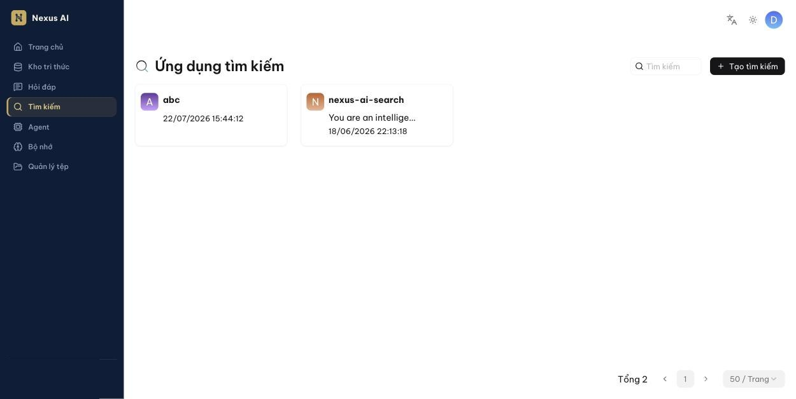
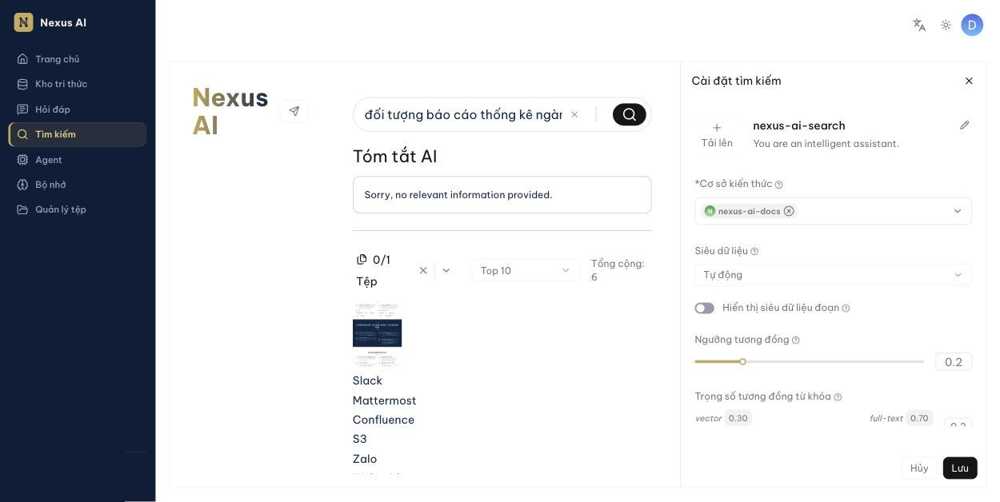
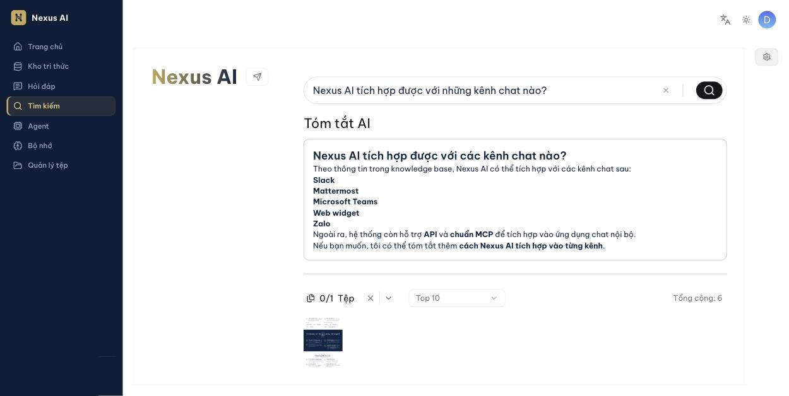

<!-- upstream: docs/guides/ai_search.md @ 91f7edf -->

# Tìm kiếm

Hỏi một lượt và nhận câu trả lời tóm tắt kèm danh sách nội dung liên quan.

---

Tìm kiếm là cuộc hỏi đáp *một lượt* dùng chiến lược truy hồi cố định (tìm kiếm lai giữa từ khóa và vector). Nó không dùng các kỹ thuật nâng cao như đồ thị tri thức. Các khối liên quan được liệt kê ngay dưới câu trả lời, xếp theo điểm tương đồng giảm dần — vì vậy tìm kiếm rất tiện để *tra cứu nhanh* và để *kiểm tra* xem kho tri thức có chứa nội dung bạn cần không.

## Tạo ứng dụng tìm kiếm

1. Nhấn **Tìm kiếm** ở thanh điều hướng bên trái, rồi nhấn **Tạo tìm kiếm**.

    

2. Đặt tên, mở ứng dụng và nhấn biểu tượng bánh răng ở góc trên bên phải để mở **Cài đặt tìm kiếm**:

    

    - **Cơ sở kiến thức**: chọn các kho tri thức muốn tìm trong đó (bắt buộc).
    - **Siêu dữ liệu**, **Hiển thị siêu dữ liệu đoạn**: lọc theo metadata, xem [Metadata](kho-tri-thuc/metadata.md).
    - **Ngưỡng tương đồng**, **Trọng số tương đồng từ khóa**, **Mô hình rerank**: giống [Kiểm tra truy hồi](kho-tri-thuc/kiem-tra-truy-hoi.md).
    - **Tóm tắt AI**: hiển thị câu trả lời tóm tắt phía trên danh sách kết quả; chọn **Mô hình** và mức **Tự do** cho phần tóm tắt.
    - **Bật tìm kiếm liên quan**: gợi ý các câu hỏi liên quan.
    - **Hiển thị sơ đồ tư duy truy vấn**: vẽ sơ đồ các ý chính của kết quả.

3. Nhấn **Lưu**.

## Tìm kiếm

Mở ứng dụng tìm kiếm, nhập câu hỏi và nhấn Enter. Kết quả gồm phần **Tóm tắt AI** (nếu bật) và danh sách các khối tài liệu liên quan bên dưới, kèm bộ lọc theo **Tệp** và số kết quả (**Top 10**). Nhấn vào từng khối để xem tài liệu gốc.

!!! tip "Mẹo"
    Khi trợ lý hỏi đáp trả lời chưa đúng, hãy thử cùng câu hỏi trong Tìm kiếm. Nếu Tìm kiếm liệt kê đúng khối cần thiết, vấn đề nằm ở cài đặt trợ lý (prompt, ngưỡng, Top N) chứ không phải ở dữ liệu.

## Điều kiện

- Quản trị viên đã cấu hình mô hình mặc định của hệ thống.
- Kho tri thức đã được cấu hình và các tài liệu đã phân tích xong.

## Câu hỏi thường gặp

### Tìm kiếm khác Hỏi đáp ở điểm nào?

| | Tìm kiếm | Hỏi đáp |
|--|----------|---------|
| Số lượt | Một lượt | Nhiều lượt, có ngữ cảnh |
| Chiến lược truy hồi | Cố định | Tùy chỉnh (ngưỡng, trọng số, rerank, đồ thị tri thức, …) |
| Prompt hệ thống | Không | Tùy chỉnh được |
| Hiển thị khối liên quan | Có, ngay dưới câu trả lời | Chỉ qua trích dẫn |
